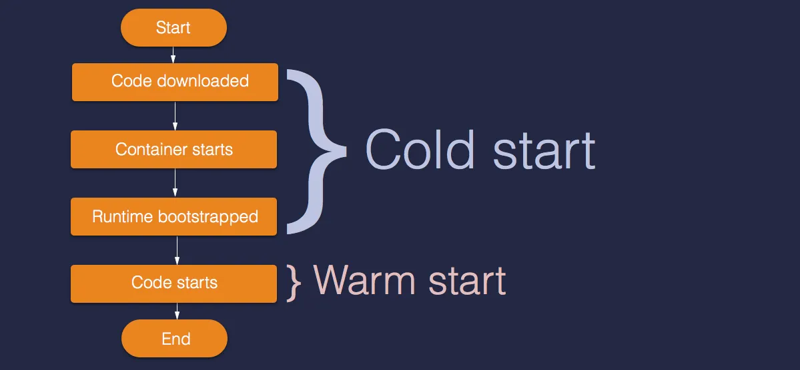

# CNCF 

## 1. Serverless example (running in local)
[Serverless Source Code](go-example/serverless/text-analyzer-l/main.go)




## 2. Kubernetes example (will demo how to deploy)

### Required tools:

1. Kind (https://kind.sigs.k8s.io/docs/user/quick-start/)
2. Docker (https://www.docker.com/)
3. kubectl (https://kubernetes.io/docs/tasks/tools/#kubectl)
4. k9s (optional) (https://k9scli.io/topics/install/)
5. go (subjective) (https://go.dev/)


### Steps:

#### 1. Modify the code to make it a service 

[K8s Source Code](go-example/k8s/text-analyzer-k/main.go)

1. Change the Entry Point
1. Add a Web Server or Framework
1. Modify Environment Variables Handling

    ```
    apiVersion: v1
    kind: ConfigMap
    metadata:
    name: game-demo
    data:
    # property-like keys; each key maps to a simple value
    player_initial_lives: "3"
    ui_properties_file_name: "user-interface.properties"

    # file-like keys
    game.properties: |
        enemy.types=aliens,monsters
        player.maximum-lives=5    
    user-interface.properties: |
        color.good=purple
        color.bad=yellow
        allow.textmode=true    
    ```

1. Update Logging and Monitoring


 #### 2. Include a [Dockerfile](go-example/k8s/text-analyzer-k/Dockerfile)
 #### 3. Include a [manifest.yaml](go-example/k8s/manifest.yaml) file
 #### 4. Build the docker image

```
> docker build -t nasirrabbani/text-analyzer-go:latest .   
```

 #### 5. Push the image to docker hub

```
> docker push nasirrabbani/text-analyzer-go:latest
```

 #### 6. Create a cluster (we can use an existing cluster as well)

```
> kind create cluster --name go-cluster
```

 #### 7. Deploy our service

```
> kubectl apply -f ../manifest.yaml
```

 #### 8. Verify if service and pods are running

```
> kubectl get deploy

> kubectl get svc

> kubectl get pods
```

#### 9. port forward

```
> kubectl port-forward svc/text-analyzer-go-service 8083:8083
```

#### 10. Test the API

#### 11. Serverless Alternatives

1. Knative (https://knative.dev/docs/)
2. OpenFaaS (https://docs.openfaas.com/)

## IaC Vs IfC

IaC : Infrastructure as Code

IfC : Infrastructure from Code (Source Code)